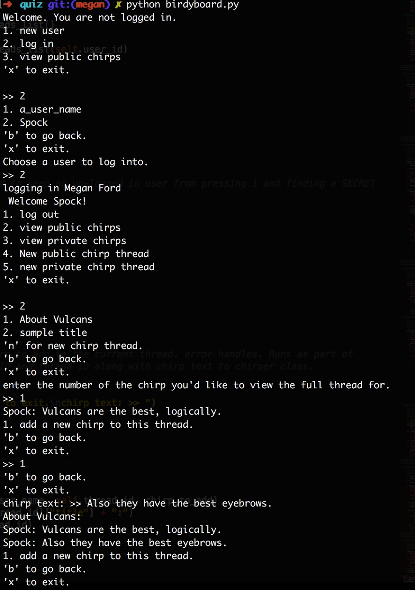

# Python Birdyboard Milestone Exercise
## Command Line Message Board
**Author**: Megan Ford July 2016 

In this app, users create and read public and private messages via terminal input.

The Birdyboard app class constructs three subclasses which pull from three serialized dictionaries: users, threads, and chirps. All items in these three files are identified by a unique UUID.

An unlogged in user can view available logins and view (but not add to) public threads and their associated chirps.
A logged in user can log out, view lists of public and private threads (and add new threads), and view and add to chirps associated with threads. they can only view the private chirps they are part of.

when a new private thread is created, the UUIDs of the two associated users are saved into its information so it is only accessible through its associated user set,
and when a new chirp is created, the UUID of the thread is saved into its information so it is only accessible through its associated thread.

Also features full forward-backward traversible menu, input error handling, and a test suite.

# Install
```
git clone ____
cd quiz
python birdyboard.py
```




## Exercise Instructions

Create a series of prompts for users to create and reply to messages in a twitter/message board hybrid.

# Requirements

1. A full test suite with full coverage of all methods
2. User data will be stored in a text file and should contain at minimum
  - A user ID number
  - Screen name
  - Full name
3. Chirps will be stored in a text file and should contain at minimum
  - A chirp ID number
  - Who authored the chirp
  - Is this a public or private chirp
  - Who the chirp is to (if applicable)
  - The text content of the chirp

### Challenge
[Serialize](https://docs.python.org/3.3/library/pickle.html) the user and chirp data before storage & deserialize on read.

# References

## How to get started

1. Tests first!
1. You can use `input()` and `print()` to show prompts and read user input.
1. You know how to use [`open()`, `readline()` and `write()`](https://docs.python.org/3.3/tutorial/inputoutput.html#reading-and-writing-files) to maniuplate data in text files.
1. You've worked with [CSV](https://docs.python.org/3.3/library/csv.html) files for data storage.
1. You can write conditional logic with `if`

Start with the basics

1. Show the main menu and read the user's choice with an `input()`.
1. Based on the user's choice, `print()` their choice, i.e. "You chose to make a new chirp."
1. Create the logic for each of the conditions to recieve further user input & display other menus.
1. Once all user input is received, perform the appropriate file action (reading from or writing to the chirps file), and direct the user back to the appropriate menu.
